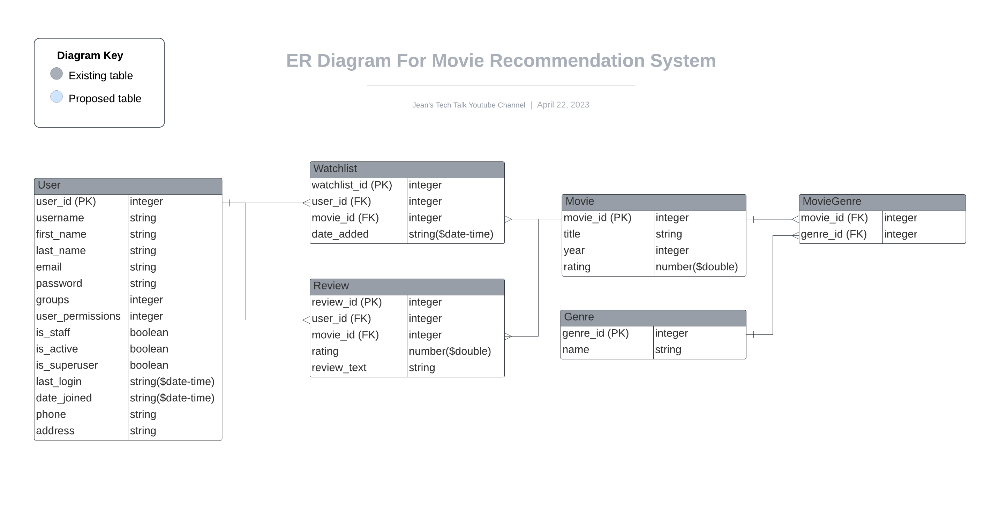

# Build Movie Recommendation Web API With Python Playlist

## ER Diagram

## Backend

This project uses a Django command for various tasks. Some of the available tasks
are listed below.

* `python manage.py makemigrations`  - Creating new migrations based on the changes you have made to your models.
* `python manage.py migrate`         - Applying and unapplying migrations.
* `python manage.py runserver`       - Run the server.

## Youtube Video

- https://www.youtube.com/@jeans-tech-talk
